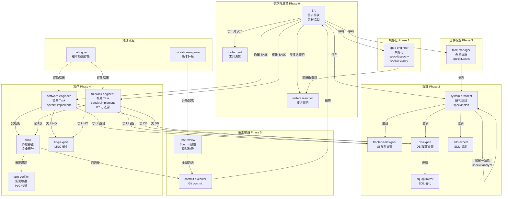

# 🎯 SDD 開發團隊架構整合方案

## 整合背景

你新增了 9 個 Agents，使團隊從 10 個擴展到 19 個。本文檔記錄了：
1. **衝突識別與解決方案**
2. **角色整合邏輯**
3. **完整流程設計**
4. **Agent 協作规則**

---

## 🔍 衝突分析與解決

### 衝突 1：fullstack-engineer vs software-engineer

**狀況**：
- `fullstack-engineer` — P7 方法論的高級 IC，全棧跨模塊
- `software-engineer` — 通用實作執行者，按 Task 執行 speckit.implement

**衝突點**：都可執行 Phase 4 實作

**解決方案** ✅：
- **軟體工程師負責**：簡單 Task（單模塊、單文件、低風險）
- **全棧工程師負責**：複雜 Task（跨模塊、多層變更、設計決策、高風險）
- **篩選標準**：由 task-manager 在 tasks.md 中標記 TASK 複雜度，BA 據此分配

---

### 衝突 2：critic vs test-review

**狀況**：
- `critic` — 全面靜態代碼審查 + 安全審計
- `test-review` — 測試暨審查工程師（Spec 一致性 + 測試驗證）

**衝突點**：都涉及代碼審查

**解決方案** ✅ **不衝突**：
- **Critic 的角色**：Phase 4 品質關卡，檢查**代碼本身的質量**（邏輯、安全、效能）
- **Test-Review 的角色**：Phase 5 最終防線，檢查**代碼與規格的一致性** + 測試完整性
- **流程順序**：critic → (vuln-verifier) → commit → test-review

---

### 衝突 3：frontend-designer 的定位

**狀況**：
- `frontend-designer` — 視覺設計 + UI 美感方向
- `software-engineer` — 通用前端實作

**衝突點**：都涉及前端

**解決方案** ✅：
- **前端設計師的角色**：Phase 2 設計方向、Phase 4 UI Task 的設計審查
- **軟體工程師的角色**：根據設計師的設計進行實作
- **流程**：designer → 產出設計 → engineer → 實作 → critic 審查

---

### 衝突 4：debugger 的定位

**狀況**：`debugger` 的職責與 software-engineer 有輕微重疊

**解決方案** ✅：
- **Debugger 的角色**：**診斷工具**，只負責根本原因分析
- **實作工程師的角色**：根據診斷結果進行修復
- **流程**：debugger → 根本原因報告 → software/fullstack-engineer → 修復 → critic 審查

---

### 衝突 5：db-expert 的冪等性

**狀況**：`db-expert` 是 read-only，不修改代碼

**解決方案** ✅：
- **Db-expert 角色**：審查與建議，不修改 plan.md 或代碼
- **流程**：db-expert 提意見 → 工程師根據意見修改 → db-expert 最終確認

---

### 衝突 6：web-researcher & tool-expert 的通用性

**狀況**：兩者都是「按需調用」的通用工具

**解決方案** ✅：
- **web-researcher** — 技術文檔查詢（API、庫、版本差異）
- **tool-expert** — 工具選型與故障診斷（build tool、MCP server、工具鏈）
- **分界線**：明確不同的領域，互不衝突

---

### 衝突 7：sdd-expert vs system-architect

**狀況**：
- `system-architect` — speckit.plan 執行（技術藍圖）
- `sdd-expert` — SDD 撰寫、架構指導

**衝突點**：都涉及技術設計

**解決方案** ✅：
- **System-architect 的角色**：主執行，調用 speckit.plan
- **Sdd-expert 的角色**：支援角色，提供 SDD 文件內容、架構建議、Mermaid 圖表
- **關係**：system-architect 可邀請 sdd-expert 協作

---

### 衝突 8：linq-expert & sql-optimizer 的領域區分

**狀況**：都涉及查詢優化

**解決方案** ✅：
- **linq-expert** — C# LINQ 語法、轉換、方法論
- **sql-optimizer** — SQL 查詢、索引、效能調校
- **分界線**：ORM 層 vs 資料庫層，各負其責

---

## 🎪 完整團隊架構圖

---

## 📋 Agent 清單與職責分類

### 核心流程 Agents（SDD 規定）

| Agent | 職責 | 能否修改 |
|-------|------|---------|
| **ba** | 需求接收、流程協調、決策審批 | ❌ 規定固定 |
| **spec-engineer** | 規格化（speckit.specify/clarify） | ✅ 可補充 |
| **system-architect** | 技術設計（speckit.plan/analyze） | ✅ 可補充 |
| **task-manager** | 任務拆解（speckit.tasks） | ✅ 可補充 |
| **software-engineer** | 簡單 Task 實作（speckit.implement） | ✅ 可補充 |
| **test-review** | 最終審查驗證 | ✅ 可補充 |
| **commit-executor** | Git commit 執行 | ❌ 規定固定 |

### 新增 Agents（品質與架構支援）

| Agent | 職責 | 調用時機 | 
|-------|------|---------|
| **fullstack-engineer** | 複雜 Task 實作（speckit.implement）+ P7 審查 | Phase 4 複雜 TASK |
| **frontend-designer** | 前端 UI 設計審查 | Phase 2、Phase 4 UI Task |
| **critic** | 靜態代碼審查 + 安全審計 | Phase 4 每個 TASK |
| **vuln-verifier** | 漏洞驗證（PoC） | critic 發現漏洞時 |
| **db-expert** | DB 設計審查（read-only） | Phase 2、Phase 4 DB Task |
| **web-researcher** | 技術文檔查詢 | 任何 Agent 遇到技術不確定 |
| **debugger** | 根本原因診斷 | Bug 修復或生產問題 |
| **migration-engineer** | 版本升級 | 版本升級維護流程 |
| **tool-expert** | 工具選型、工具故障診斷 | Phase 0、工具問題時 |

### 領域專家 Agents（按需調用）

| Agent | 職責 | 調用者 | 
|-------|------|--------|
| **sdd-expert** | SDD 撰寫、架構指導 | system-architect |
| **linq-expert** | LINQ 查詢優化 | software/fullstack-engineer |
| **sql-optimizer** | SQL 查詢優化 | db-expert、software/fullstack-engineer |

---

## 🎯 決策規則

### 何時選擇 software-engineer vs fullstack-engineer

**Software-engineer 適用場景**：
- ✅ 單一模塊、單文件修改
- ✅ 功能局限在一層（只改前端、只改後端、只改 DB）
- ✅ 變更範圍小、風險低
- ✅ 無需跨層設計決策

**Fullstack-engineer 適用場景**：
- ✅ 跨前後端多層改動
- ✅ 需要重新設計某個子系統
- ✅ 涉及複雜的 API 合約變更
- ✅ 高風險、高複雜度

**判定方法**：由 task-manager 在 tasks.md 中使用 `複雜度: 低/中/高` 標記

---

## 📊 Phase 4 複雜度評分表

| 項目 | 低 | 中 | 高 |
|------|-----|-------|--------|
| **涉及文件數** | 1-3 | 4-8 | 9+ |
| **涉及模塊數** | 1 | 2 | 3+ |
| **跨層數量** | 1 | 2 | 3+ |
| **新 API 設計** | 否 | 部分新增 | 重大變更 |
| **DB 變更** | 無 | schema 擴展 | 結構重構 |
| **前端 UI** | 無 | 修改現有組件 | 新頁面/新流程 |
| **測試複雜度** | Unit Only | Unit + Integration | Unit + Integration + E2E |

**評分**：
- 大多數項為「低」→ **software-engineer**
- 大多數項為「中」或有「高」項 → **fullstack-engineer**

---

## ✅ 質量檢查清單

### Phase 完成檢查清單

**Phase 1 完成條件**：
- [ ] spec.md 存在且完整
- [ ] 所有 [PENDING-USER-DECISION] 項已確認或排除
- [ ] spec-engineer 提供了 [P7-COMPLETION] 或等效完成標誌
- [ ] commit-executor 執行了 Phase 1 commit

**Phase 2 完成條件**：
- [ ] plan.md 存在且完整
- [ ] 所有涉及 DB 的設計已通過 db-expert 審查
- [ ] 所有涉及 UI 的設計已通過 frontend-designer 審查
- [ ] system-architect 提供了完成標誌
- [ ] commit-executor 執行了 Phase 2 commit

**Phase 3 完成條件**：
- [ ] tasks.md 存在且每個 TASK 有 ID、DoD、複雜度標記
- [ ] speckit.analyze 已執行且通過
- [ ] 無一致性問題或已全數解決
- [ ] commit-executor 執行了 Phase 3 commit

**Phase 4 完成條件（每個 TASK）**：
- [ ] 工程師選擇正確（簡單→software, 複雜→fullstack）
- [ ] 代碼完成 + 測試完成
- [ ] critic 審查已通過
- [ ] 如有漏洞，vuln-verifier 已確認
- [ ] commit-executor 執行了 TASK commit

**Phase 5 完成條件**：
- [ ] test-review 執行了 Code Review（Spec 一致性檢查）
- [ ] test-review 執行了測試驗證（覆蓋率、類型檢查）
- [ ] 無重大問題或已全數解決
- [ ] commit-executor 執行了 Phase 5 commit（chore: 審查通過）

---

## 🚀 推薦 Agent 學習順序

### 第一批（基礎流程）
1. `ba.agent.md` — 理解整個流程
2. `spec-engineer.agent.md` — 規格化流程
3. `system-architect.agent.md` — 技術設計

### 第二批（實作與審查）
4. `software-engineer.agent.md` — 簡單實作
5. `fullstack-engineer.agent.md` — 複雜實作
6. `critic.agent.md` — 代碼審查

### 第三批（支援角色）
7. `frontend-designer.agent.md` — UI 設計
8. `db-expert.agent.md` — DB 審查
9. 其他專家

---

## 📝 修改記錄

| 日期 | 修改項 | 說明 |
|------|--------|------|
| 2026-05-05 | 新增 9 agents 整合 | 補充 fullstack-engineer、frontend-designer、critic、vuln-verifier、db-expert、web-researcher、debugger、migration-engineer、tool-expert 的協作機制 |
| 2026-05-05 | 衝突解決 | 明確 software vs fullstack 的分工、critic vs test-review 的職責分界 |
| 2026-05-05 | 完整流程設計 | 定義 5 個 SDD Phase 的完整協作流程 + 3 個維護流程 |
| 2026-05-05 | 團隊協調指南 | 創建 TEAM_COORDINATION_GUIDE.md 供快速查閱 |

---

## 💡 最佳實踐

### ✅ 推薦做法
- 定期查閱 TEAM_COORDINATION_GUIDE.md 確認 Agent 調用時機
- 在 task-manager 階段明確標記 Task 複雜度，以便正確分配工程師
- 讓 critic 和 test-review 獨立運作，避免審查衝突
- 鼓勵工程師主動邀請領域專家（db-expert、frontend-designer、linq-expert 等）
- 定期回顧各 Phase 完成條件清單，確保品質

### ❌ 禁止做法
- ❌ BA 跳過 spec-engineer 直接進行技術設計
- ❌ 軟體工程師自行決定複雜 TASK，不邀請 fullstack-engineer
- ❌ 跳過 critic 審查直接 commit
- ❌ 忽視 Agent 的反饋或問題報告
- ❌ 未經 test-review 驗證就發佈特性

